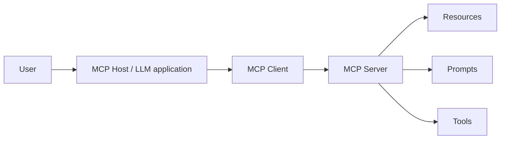

# MCP Architecture: Host, Client & Server

The Model Context Protocol standardizes how LLM applications connect to external context and capabilities.



- **Host**: the application that owns the user experience, model and policy.
- **Client**: the connector within the host that speaks MCP to one server.
- **Server**: exposes resources, prompts, tools and supported protocol capabilities.

```ts
type McpConnection = {
  serverUrl: string;
  trustedServerId: string;
  allowedCapabilities: string[];
};
```

MCP is not an agent framework. It standardizes an integration boundary; planning, memory, agent loops, authorization policy and product workflow still belong to the host/application.

## Practice

1. Which component owns the LLM and product policy?
2. Why can one host create multiple MCP clients?
3. What does an MCP server provide?
4. Why is MCP complementary to agent frameworks?
