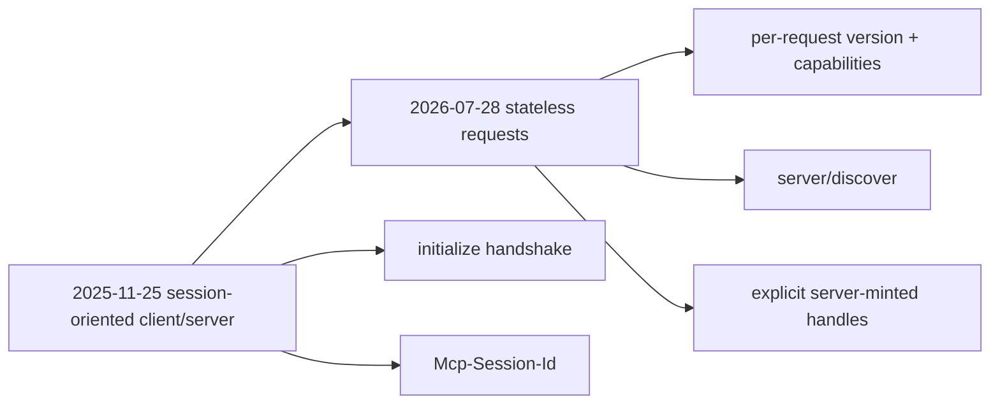

# Migrating from MCP 2025-11-25 to 2026-07-28

The 2026 revision is a major architectural shift.



Key migration points include:

- remove protocol-level sessions and `Mcp-Session-Id`;
- remove initialize/initialized handshake;
- add per-request protocol/capability metadata;
- use `server/discover`;
- move long-running tasks to the Tasks extension;
- use MRTR `input_required` for extra input;
- migrate old subscription behavior to `subscriptions/listen`;
- avoid deprecated Roots, Sampling, Logging and HTTP+SSE in new implementations.

```ts
type MigrationChecklist = {
  statelessRequests: boolean;
  discoveryImplemented: boolean;
  oldSessionHeaderRemoved: boolean;
  tasksExtensionReviewed: boolean;
  deprecatedFeaturesRemoved: boolean;
};
```

## Practice

1. What replaced `Mcp-Session-Id` state?
2. What replaced initialization negotiation?
3. Which client features are deprecated for new implementations?
4. Why should old and new protocol behavior be tested separately during rollout?
