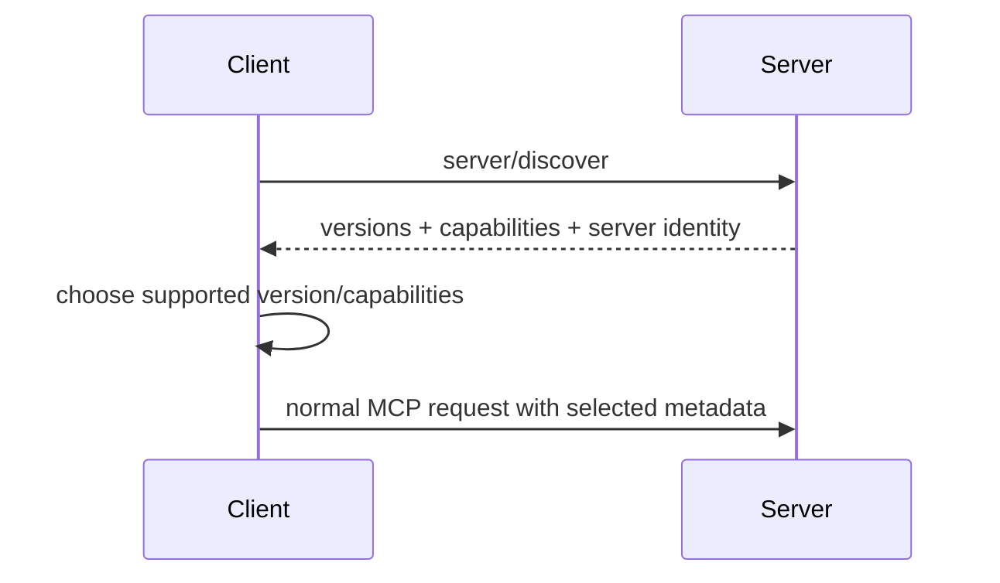

# server/discover & Protocol Negotiation

In MCP 2026-07-28, servers implement **`server/discover`** to advertise supported protocol versions, capabilities and identity. A client can call discovery before normal requests to select a compatible protocol version.



```ts
type DiscoveryResult = {
  protocolVersions: string[];
  capabilities: Record<string, unknown>;
  serverInfo: { name: string; version?: string };
};
```

Discovery is also useful for trust decisions: the host can compare server identity/capabilities against an allowlist before exposing capabilities to a model.

## Practice

1. Why was explicit discovery added?
2. When should a client refuse a server after discovery?
3. How can discovery help backward compatibility?
4. Why should server identity not be trusted blindly merely because it is returned by the server?
