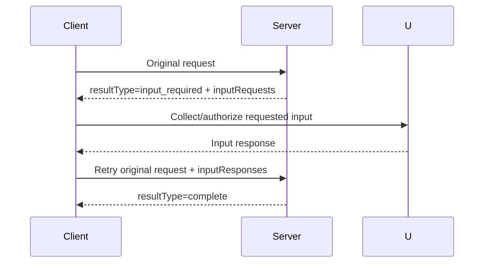

# Elicitation & Multi Round-Trip Requests

MCP 2026-07-28 introduces a **Multi Round-Trip Request (MRTR)** pattern for cases where a server needs extra user/client information before it can complete the original request.



```ts
type InputRequired = {
  resultType: 'input_required';
  inputRequests: unknown[];
  requestState?: unknown;
};
```

This replaces the older pattern of arbitrary server-initiated requests such as elicitation/sampling/roots calls in the core flow.

## Practice

1. What does `resultType: input_required` mean?
2. How does the client continue the original operation?
3. Where should user consent be captured?
4. Why is explicit retry easier to reason about than hidden bidirectional session state?
