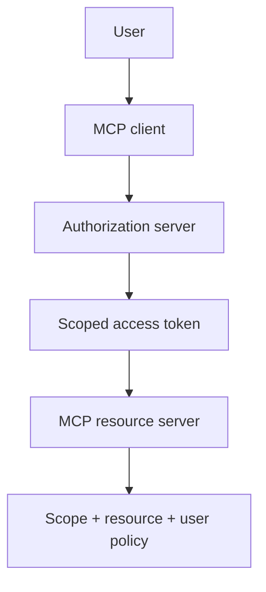

# MCP OAuth, Consent & Authorization Security

Remote MCP servers often require OAuth-based authorization. Authentication establishes identities/tokens; **authorization** decides which resources/actions a user or client may access.



```ts
type McpAuthContext = {
  issuer: string;
  subject?: string;
  scopes: string[];
  resourceAudience: string;
};
```

Security requirements include validating issuer/audience, using PKCE where applicable, binding credentials to the authorization server that issued them, minimizing scopes, protecting refresh tokens and preventing token forwarding between unrelated servers.

The 2026 changelog favors Client ID Metadata Documents over OAuth Dynamic Client Registration for new implementations, while retaining DCR for compatibility.

## Practice

1. Why should one MCP server never receive another server's bearer token?
2. What does resource audience protect?
3. Why are broad scopes dangerous for agents?
4. What issuer validation must happen before token exchange/use?
