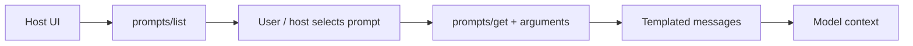

# MCP Prompts

MCP **prompts** expose reusable templated messages/workflows from a server. They can help users discover server-supported interaction patterns.



```ts
type PromptTemplate = {
  name: string;
  description?: string;
  arguments?: Array<{ name: string; required?: boolean }>;
};
```

Prompt content from an MCP server is still external content. A host should not let a remote prompt override its own higher-level security/policy instructions.

## Practice

1. Why are prompts different from tools?
2. Who should decide whether a remote prompt is offered to a user?
3. How can a prompt become an injection vector?
4. Why should prompt templates be versioned/evaluated like application prompts?
