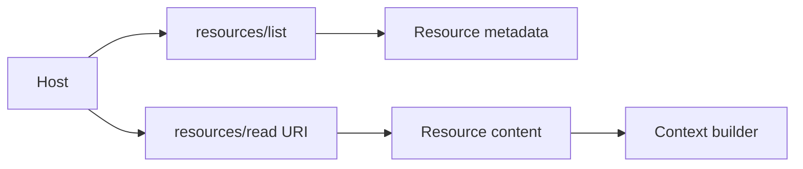

# MCP Resources & Cache Hints

MCP **resources** expose context/data identified by URIs. They are suitable for documents, configuration, records and other context that the host/user/model may inspect.



```ts
type ResourceRecord = {
  uri: string;
  mimeType?: string;
  tenantScope?: string;
  ttlMs?: number;
  cacheScope?: 'public' | 'private';
};
```

In the 2026 revision, cacheable list/read results carry freshness and cache-scope hints. These help clients cache safely but do not override authorization or tenancy rules.

## Practice

1. How is a resource different from a tool?
2. What does `ttlMs` communicate?
3. Why does `private` cache scope matter?
4. What checks must occur before placing a resource into model context?
