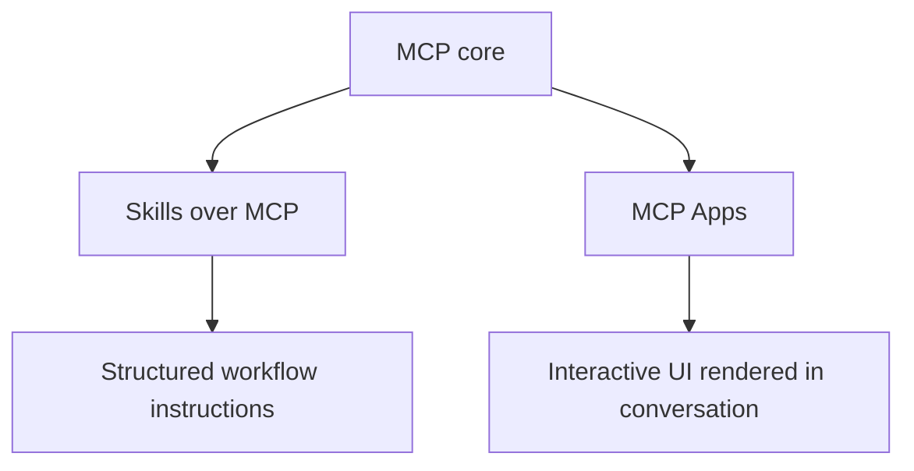

# Skills over MCP & MCP Apps

The 2026 ecosystem defines optional extensions beyond the core protocol.



**Skills over MCP** allow rich structured instructions/workflow capabilities to be discovered and consumed through MCP. **MCP Apps** allow interactive UI elements such as forms, charts or media experiences to be rendered within supporting hosts.

```ts
type ExtensionCapability = {
  uri: string;
  version?: string;
  enabled: boolean;
};
```

Extensions are opt-in and require explicit support/negotiation. Do not assume every MCP host/server implements them.

## Practice

1. Why are Skills and Apps extensions rather than universal core behavior?
2. What new trust boundary does an interactive MCP App create?
3. How should hosts handle unknown extensions?
4. Why must extension capabilities be negotiated explicitly?
