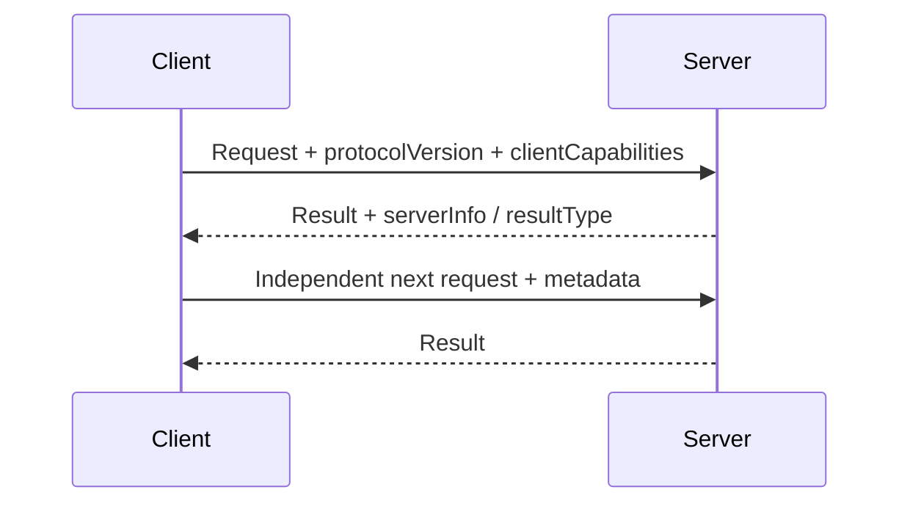

# Stateless Requests & Per-Request Capabilities

The 2026-07-28 MCP revision makes the protocol core **stateless**. Protocol-level sessions and the old initialize/initialized handshake were removed. Each request carries protocol version and client capabilities in request metadata.



Conceptual request metadata:

```ts
type McpRequestMeta = {
  'io.modelcontextprotocol/protocolVersion': string;
  'io.modelcontextprotocol/clientCapabilities': Record<string, unknown>;
  'io.modelcontextprotocol/clientInfo'?: Record<string, unknown>;
};
```

If a server needs cross-call state, it should mint an explicit handle and return/pass it through ordinary protocol data rather than depending on an implicit transport session.

## Practice

1. What replaced the initialize handshake?
2. How should a server represent state that survives multiple calls?
3. Why is a request-scoped capability model useful for intermediaries/scaling?
4. What should happen on protocol-version mismatch?
