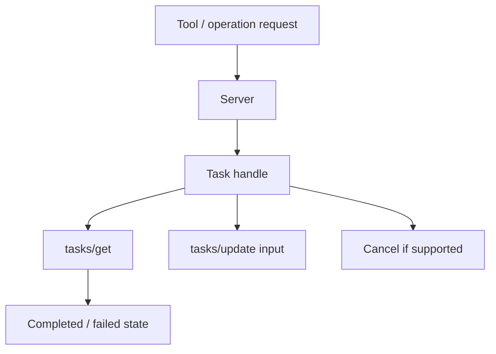

# MCP Tasks Extension

Long-running asynchronous operations live in the official **Tasks extension**, not the 2026 core protocol.



```ts
type TaskHandle = {
  taskId: string;
  status: 'working' | 'input_required' | 'completed' | 'failed' | 'cancelled';
};
```

The 2026 design moved experimental tasks out of core, favors polling through `tasks/get`, supports client input through `tasks/update`, and allows servers to return task handles for asynchronous work.

## Practice

1. Why are tasks an extension rather than core?
2. What is a durable task handle for?
3. How would task updates interact with user approval?
4. What idempotency considerations apply when retrying task creation?
