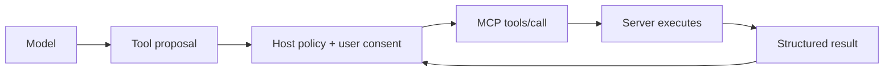

# MCP Tools

MCP **tools** expose callable operations. A model may propose a tool invocation through the host, but the host remains responsible for consent, authorization and execution policy.



```ts
type ToolDescriptor = {
  name: string;
  description?: string;
  inputSchema: object;
  outputSchema?: object;
};
```

Treat descriptions/annotations from remote servers as untrusted metadata unless the server is trusted. Tool schemas constrain shape, not authorization. The 2026 schema supports JSON Schema 2020-12 features more broadly.

## Practice

1. Who decides whether a tool may execute?
2. Why are tool descriptions a prompt-injection surface?
3. What must be checked after schema validation?
4. How would you classify read vs write tools by risk?
