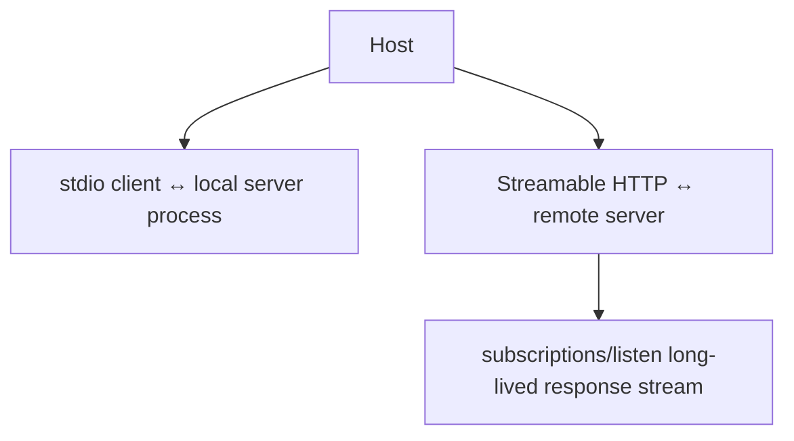

# stdio, Streamable HTTP & subscriptions/listen

MCP commonly runs over **stdio** for local process integrations or **Streamable HTTP** for remote services. The older HTTP+SSE transport is deprecated in the 2026-07-28 lifecycle guidance.



The 2026 revision replaces prior HTTP GET/resource-subscription mechanics with `subscriptions/listen` for opted-in server-to-client change notifications.

```ts
type SubscriptionKinds = {
  toolsListChanged?: boolean;
  promptsListChanged?: boolean;
  resourcesListChanged?: boolean;
  resourceSubscriptions?: boolean;
};
```

Request-scoped progress/messages stay with the response stream of the request they belong to.

## Practice

1. When is stdio appropriate?
2. What replaced the old general HTTP GET/SSE stream behavior?
3. Why are request-scoped progress events different from subscription-list change events?
4. Which deprecated transport should new implementations avoid?
