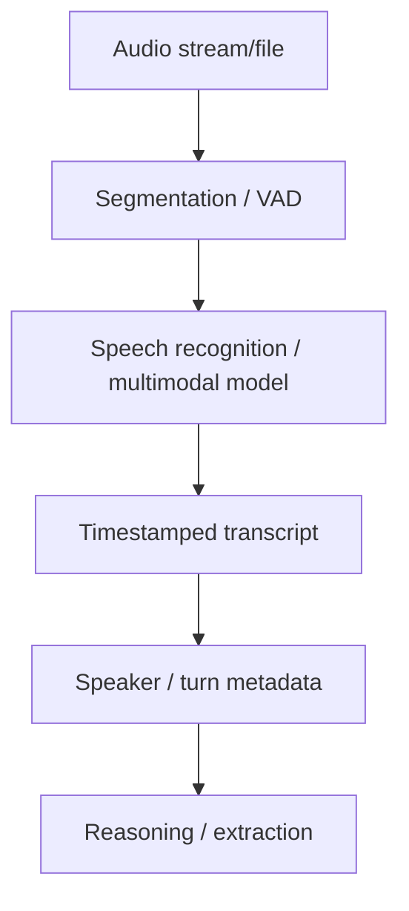

# Speech & Audio Understanding

Audio understanding includes speech transcription, language identification, speaker/turn structure and sometimes non-speech sound reasoning.



```ts
type TranscriptSegment = {
  startMs: number;
  endMs: number;
  speaker?: string;
  text: string;
};
```

## Streaming vs file processing

Realtime transcription prioritizes latency and partial hypotheses. Offline processing can spend more compute on accuracy, diarization and long-context reconciliation.

## Practice

1. What is VAD?
2. Why are timestamps important for citations?
3. What is the difference between transcription and diarization?
4. How would you evaluate a call-center audio pipeline beyond word error rate?
