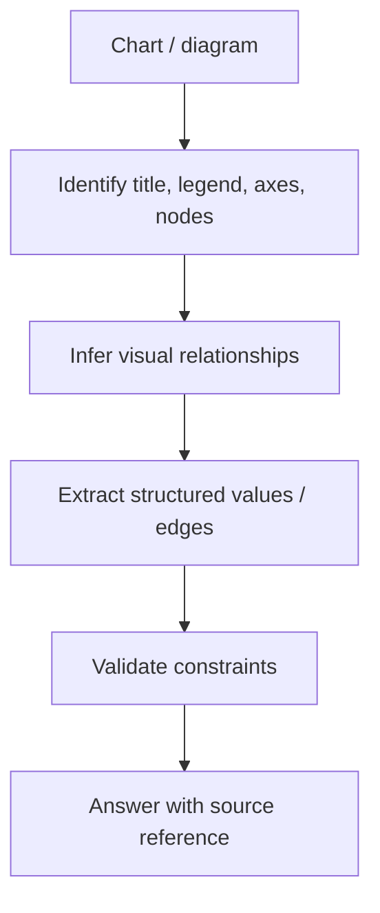

# Charts, Tables & Diagram Understanding

Charts and diagrams encode relationships spatially. Flattening them into OCR text can lose axes, legends, topology and correspondence.



```ts
type ChartPoint = {
  series: string;
  x: string | number;
  y: number;
  confidence?: number;
};
```

## Reliability

For important numeric extraction, compare model output against a chart/table parser when possible. Require evidence such as page/figure ID and avoid accepting invented values that are not visibly supported.

## Practice

1. Why can OCR alone misread a chart?
2. What structured representation would you use for a flow diagram?
3. How would you validate extracted chart values?
4. What provenance should be retained in a multimodal RAG index?
