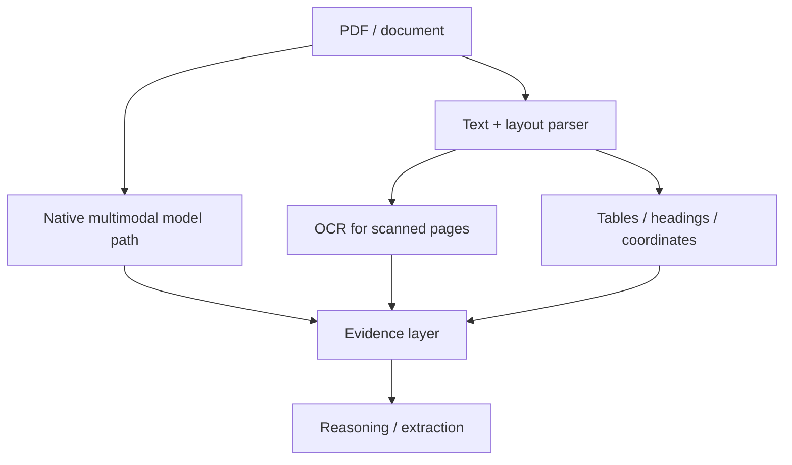

# PDFs, OCR & Layout-Aware Document Understanding

Documents combine text, layout, tables, figures and metadata. A robust pipeline may use native document/vision input, OCR/text extraction, structural parsing or a combination.



```ts
type DocumentEvidence = {
  documentId: string;
  page: number;
  text?: string;
  bbox?: [number, number, number, number];
  kind: 'paragraph' | 'table' | 'figure' | 'ocr';
};
```

## Hybrid processing

Native multimodal reasoning can understand charts and layout that plain extraction loses, while parsed text provides searchable/citable evidence and lower-cost retrieval. Use both when accuracy warrants it.

## Practice

1. When is OCR necessary?
2. Why keep page and bounding-box metadata?
3. What information can plain text extraction lose?
4. Design a pipeline for invoices containing stamps, tables and handwritten notes.
