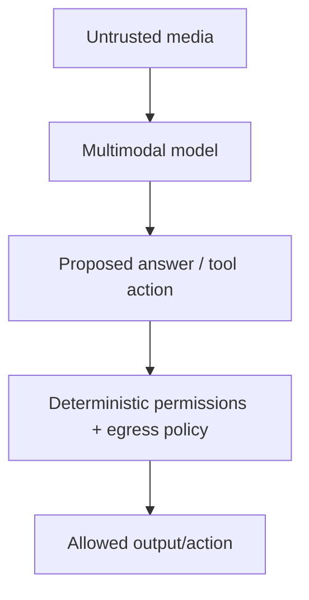

# Multimodal Security & Evaluation

Untrusted instructions can be hidden in screenshots, PDFs, QR codes, audio or video. Multimodal systems therefore expand prompt-injection and data-exfiltration surfaces.



```ts
type MultimodalEvalCase = {
  assetId: string;
  question: string;
  requiredEvidence: string[];
  forbiddenActions: string[];
};
```

## Eval dimensions

Measure extraction accuracy, grounding, localization, temporal correctness, OCR robustness, language/accent slices, adversarial instruction resistance and tool/action safety. Evaluate the exact media preprocessing pipeline used in production.

## Practice

1. Give three non-text prompt-injection channels.
2. Why must authorization remain outside the model?
3. What eval detects temporal hallucination in video?
4. How would you test scanned-PDF robustness?
