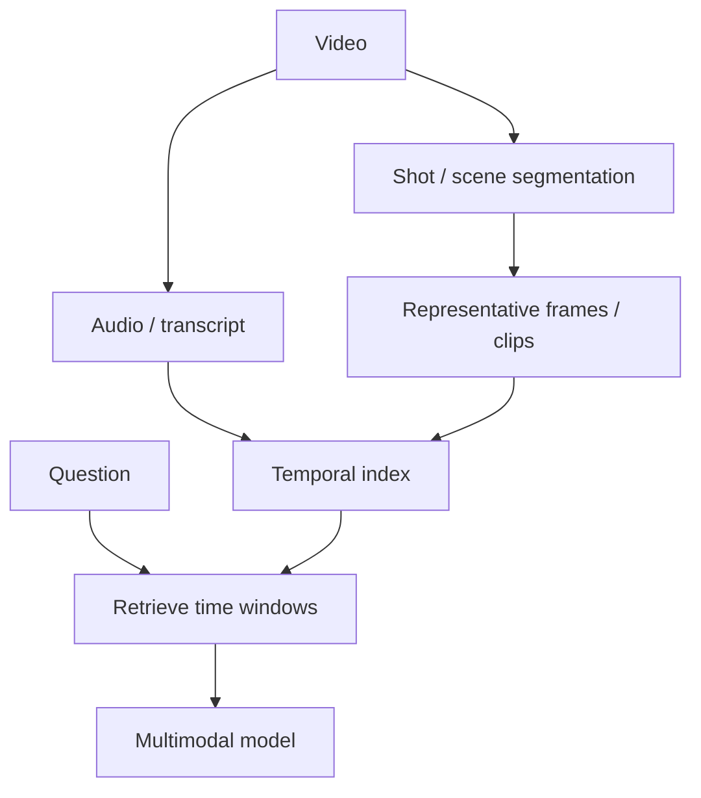

# Video Understanding & Temporal Reasoning

Video combines frames, motion, audio and time. Sending every frame is usually inefficient; systems sample, segment or retrieve relevant temporal windows.



```ts
type VideoEvidence = {
  assetId: string;
  startMs: number;
  endMs: number;
  frameIds?: string[];
  transcript?: string;
};
```

## Temporal reasoning

Questions such as “what happened before the alarm?” require order, not just object recognition. Preserve timestamps and avoid treating sampled frames as if nothing happened between them.

## Practice

1. Why not send every video frame?
2. What role does a transcript play?
3. How do you cite a video answer?
4. Design a retrieval strategy for a two-hour meeting recording.
