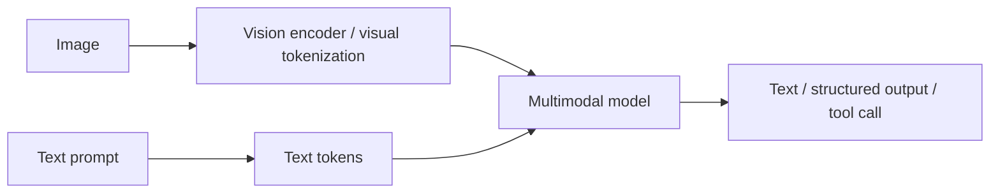

# Vision-Language Models & Image Understanding

Vision-language models combine visual inputs with language reasoning. The application sends images or image-derived representations together with text instructions/context.



```ts
type VisionRequest = {
  prompt: string;
  images: Array<{ url: string; mimeType: 'image/png' | 'image/jpeg' }>;
};
```

## Resolution and cost

Providers/models convert images into internal visual tokens/features according to their own policies. Higher resolution or more images can increase context/latency/cost. Measure with the chosen provider rather than assuming pixels map directly to tokens.

## Grounding

For extraction tasks, ask for bounding boxes/regions only if the model/API supports meaningful localization, and validate critical values with deterministic parsers or secondary checks.

## Practice

1. Why is image understanding not equivalent to OCR?
2. What changes when you send ten images instead of one?
3. How can you preserve provenance for an answer about an image?
4. When should vision output be validated deterministically?
