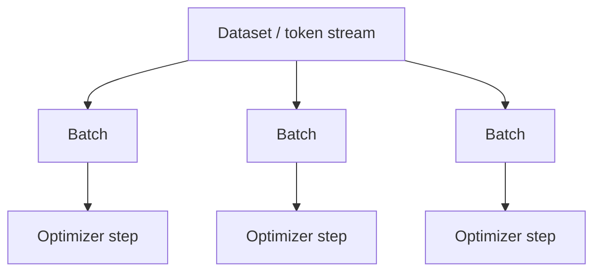

# Batches, Epochs & Learning Rate

A **batch** is the set of training examples processed for one gradient calculation. An **epoch** traditionally means one pass through a finite dataset. Large-scale LLM pretraining is often discussed in **steps** and **tokens processed** because datasets are enormous and may be streamed or mixed.



## Effective batch size

If a GPU cannot hold a large batch, **gradient accumulation** combines gradients from several micro-batches before taking an optimizer step.

```ts
const microBatches = 8;
const examplesPerMicroBatch = 4;
const effectiveExamples = microBatches * examplesPerMicroBatch;
console.log({ effectiveExamples });
```

Distributed training adds another factor: number of data-parallel workers. For token training, sequence lengths also change the number of tokens represented by a batch.

## Why batch size matters

Larger batches can improve hardware utilization and reduce gradient noise, but they consume more memory and often require learning-rate retuning. Small batches create noisier updates but can be useful when memory is constrained.

## Learning rate

The learning rate controls update magnitude. It is not independent of optimizer, batch size or training phase. Common schedules include cosine decay, linear decay and warmup-plus-decay.

## LLM-specific planning

Think in terms of **tokens per step** and **total training tokens**, not only document counts. Packing multiple short examples into full-length sequences can materially improve accelerator utilization.

## Practice

1. Distinguish micro-batch size from effective batch size.
2. Why might a training system report tokens/sec rather than examples/sec?
3. What does gradient accumulation buy you, and what does it not buy you?
4. Why can changing batch size require learning-rate retuning?
