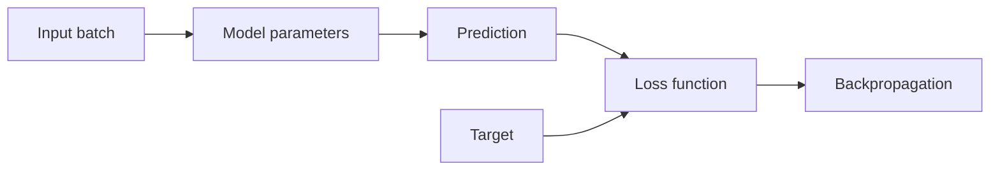

# Forward Pass & Loss Functions

A **forward pass** sends input through the model to produce a prediction. A **loss function** measures how far that prediction is from the training target. Training repeatedly reduces this loss by adjusting model parameters.



## Mental model

A model is a parameterized function `fθ(x)`. During a forward pass, the current weights `θ` transform input `x` into prediction `ŷ`. The loss compares `ŷ` with target `y`.

For language modeling, the model predicts a probability distribution over the next token. Cross-entropy penalizes the model when the correct token receives low probability.

```ts
function crossEntropy(probabilityOfTarget: number): number {
  if (probabilityOfTarget <= 0 || probabilityOfTarget > 1) {
    throw new Error('probability must be in (0, 1]');
  }
  return -Math.log(probabilityOfTarget);
}

console.log(crossEntropy(0.9)); // small loss
console.log(crossEntropy(0.1)); // much larger loss
```

## Why this matters for LLMs

Pretraining is not a database import. The model sees token sequences, predicts next tokens, receives a loss signal, and updates weights across enormous numbers of examples. Knowledge becomes distributed statistical structure in parameters rather than rows you can query exactly.

## Practical engineering implications

- training metrics and inference metrics are different;
- lower training loss does not automatically mean better product behavior;
- validation data is needed to detect overfitting;
- task quality requires task-specific evals in addition to generic language-model loss.

## Common mistakes

- treating loss as the same thing as accuracy;
- evaluating only on training examples;
- assuming a lower loss guarantees factuality or safety;
- confusing forward-pass activations with persistent application memory.

## Practice

1. Why is a forward pass required during both training and inference?
2. Why is loss required during training but not necessarily during ordinary inference?
3. What happens to cross-entropy when the target token probability approaches 1?
4. Explain why low language-model loss does not guarantee grounded answers.
