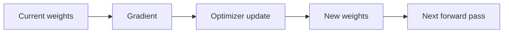
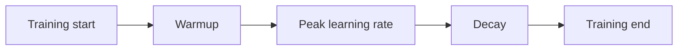

# Gradient Descent & Optimizers

Training uses gradients to update weights. The simplest rule is **gradient descent**: move parameters in the direction that locally reduces loss.



For one parameter, the conceptual update is:

```text
newWeight = oldWeight - learningRate * gradient
```

```ts
function sgd(weight: number, gradient: number, learningRate: number) {
  return weight - learningRate * gradient;
}

console.log(sgd(2, 0.4, 0.01));
```

## SGD, momentum, Adam and AdamW

Plain SGD uses the current gradient. **Momentum** accumulates a moving direction so noisy mini-batch gradients do not completely redirect each step. **Adam** tracks moving estimates of first and second gradient moments and adapts per-parameter step sizes. **AdamW** decouples weight decay from the Adam update and is a common transformer-training choice.

You do not choose an optimizer by brand recognition. The optimizer interacts with learning rate, batch size, warmup, schedule, precision and model architecture.

## Learning-rate schedules

Large transformer training often uses a warmup period followed by decay.



Warmup avoids extremely aggressive early updates before optimizer statistics and activations stabilize.

## Production metrics

Track at least loss, learning rate, gradient norm, tokens processed, throughput, GPU utilization, checkpoint health and validation metrics. A job that is technically running can still be silently diverging.

## Practice

1. Why can a learning rate that is too high make loss unstable?
2. Why is AdamW commonly used for transformers?
3. What problem does warmup address?
4. Why should optimizer choice be evaluated together with batch size and schedule?
