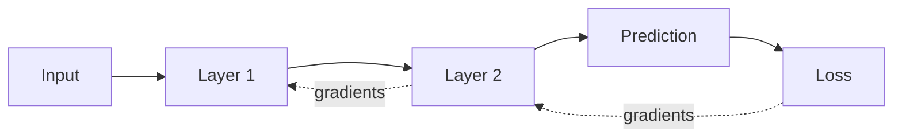

# Gradients & Backpropagation

A **gradient** tells us how a small change in a parameter would change the loss. **Backpropagation** efficiently applies the chain rule from the loss backward through the computation graph so every trainable parameter receives a gradient.



## Computation-graph mental model

During the forward pass, intermediate values are produced. During the backward pass, autodiff follows those operations in reverse and computes partial derivatives. A positive gradient does not mean a weight is “good”; it means increasing that weight would increase loss locally, assuming other values stay fixed.

A toy scalar example:

```ts
// loss = (w*x - y)^2
function lossAndGradient(w: number, x: number, y: number) {
  const prediction = w * x;
  const error = prediction - y;
  const loss = error ** 2;
  const dLossDw = 2 * error * x;
  return { prediction, loss, dLossDw };
}

console.log(lossAndGradient(1, 2, 6));
```

Real LLMs have billions of parameters and huge tensor graphs, so frameworks such as PyTorch implement automatic differentiation instead of engineers deriving every derivative by hand.

## Why gradients can fail

- **vanishing gradients** make updates extremely small;
- **exploding gradients** make updates unstable;
- numerical overflow/underflow can corrupt training;
- stale or incorrect gradients can happen when accumulation or optimizer steps are ordered incorrectly.

Gradient clipping is one mitigation for exploding gradients, but it does not fix a fundamentally bad learning rate or broken data pipeline.

## LLM connection

Transformer residual paths, normalization, initialization, optimizer choices, precision, batch size, and sequence length all affect training stability. Backpropagation is the mechanism that turns next-token prediction error into updates to attention, MLP, embedding, and other trainable weights.

## Practice

1. What does the sign of a gradient tell you?
2. Why does backpropagation run after a forward pass?
3. Explain vanishing vs exploding gradients.
4. Why do production training systems monitor gradient norms?
