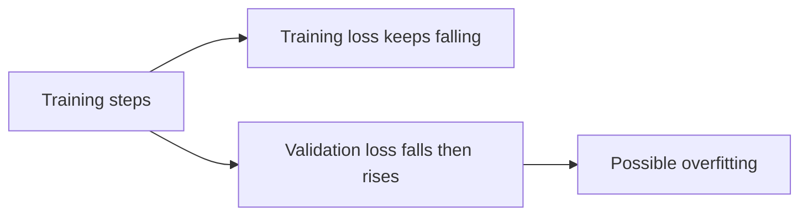

# Overfitting & Regularization

**Overfitting** happens when a model fits training patterns better than it generalizes to unseen data.



## Warning signs

- training loss improves while validation metrics stall or degrade;
- memorized examples look excellent but nearby variations fail;
- fine-tuning causes regressions on capabilities outside the narrow dataset;
- synthetic training data introduces repetitive style or artifacts.

## Regularization techniques

Depending on architecture and training setup, regularization can include weight decay, dropout, data augmentation, early stopping, stronger data diversity and reduced fine-tuning duration. For LLM adaptation, preserving representative general-capability evals helps detect catastrophic forgetting.

```ts
function shouldEarlyStop(history: number[], patience: number) {
  if (history.length <= patience) return false;
  const bestEarlier = Math.min(...history.slice(0, -patience));
  const recentBest = Math.min(...history.slice(-patience));
  return recentBest >= bestEarlier;
}
```

## Underfitting

The opposite failure matters too: if both training and validation performance remain poor, the model, data, optimization setup or training duration may be insufficient.

## Practice

1. What metric pattern suggests overfitting?
2. How can an overly narrow SFT dataset damage a model?
3. Why is early stopping a regularization technique?
4. Distinguish overfitting from data leakage.
