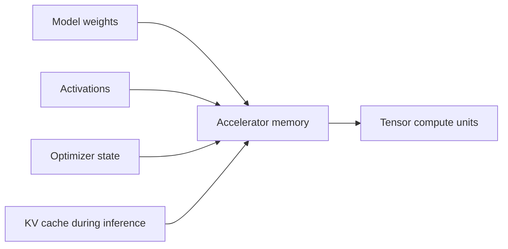

# Numerical Precision, GPUs & AI Accelerators

LLM training and inference are dominated by large tensor operations. GPUs and other accelerators execute these operations with massive parallelism, but memory bandwidth and memory capacity are often as important as raw arithmetic throughput.



## Precision

Common numeric formats include FP32, BF16, FP16, FP8 and integer formats used in quantization. Lower precision reduces memory and can increase throughput, but range and accuracy trade-offs differ.

```ts
const params = 7_000_000_000;
const bytesPerParameter = 2; // rough BF16/FP16 weight storage only
const gib = (params * bytesPerParameter) / 1024 ** 3;
console.log(`${gib.toFixed(1)} GiB for weights only`);
```

This estimate excludes activations, optimizer states, gradients, allocator overhead and KV cache.

## Training vs inference memory

Training usually needs far more memory because gradients, activations and optimizer state coexist with weights. Inference can use aggressive quantization and does not retain backward-pass state, but long contexts can make KV cache substantial.

## Practice

1. Why is parameter-count × bytes-per-parameter only a lower-bound memory estimate?
2. Why can BF16 be preferred over FP16 in some training regimes?
3. Name two reasons inference memory can still grow after model weights are loaded.
4. Explain why memory bandwidth can limit token generation.
