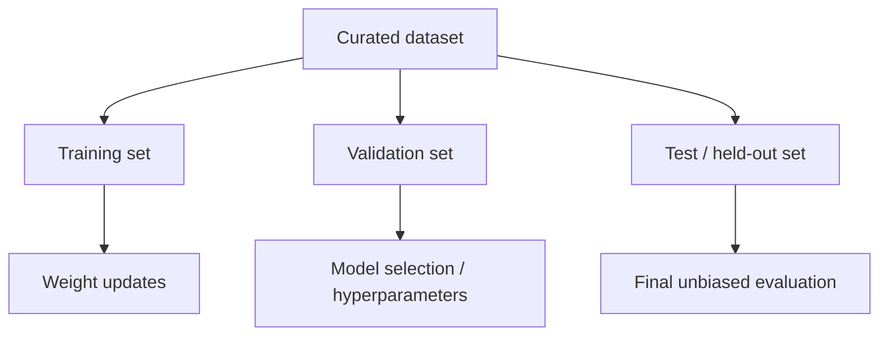

# Training, Validation & Test Sets

A model should not be judged on the same examples used to update its weights.



## Roles of each split

- **Training data** contributes gradients and changes weights.
- **Validation data** measures generalization during development and helps choose hyperparameters/checkpoints.
- **Test data** should remain held out until a meaningful evaluation point.

If you repeatedly optimize against the test set, it effectively becomes another validation set.

## Leakage

Leakage can happen through duplicated documents, generated paraphrases, benchmark answers in training corpora, prompt examples copied from evals, or metadata that reveals the label.

```ts
function normalizedKey(text: string) {
  return text.toLowerCase().replace(/\s+/g, " ").trim();
}

const trainKeys = new Set(trainTexts.map(normalizedKey));
const leaked = testTexts.filter(t => trainKeys.has(normalizedKey(t)));
```

Exact deduplication is only a first step; near-duplicate and semantic contamination require stronger detection.

## Product evals are different

A generic held-out language-model set does not replace product-specific evals for tool accuracy, retrieval grounding, structured output, safety, cost, latency and domain correctness.

## Practice

1. Why is repeated test-set tuning a methodological problem?
2. Give three ways benchmark contamination can happen.
3. Why can validation loss improve while product quality worsens?
4. Design a split strategy for support tickets where the same customer may have many similar tickets.
