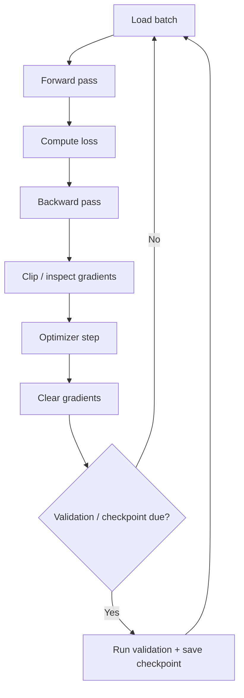

# The Complete Training Loop

The training loop connects data loading, forward computation, loss, backpropagation, optimizer updates, validation and checkpointing.



A framework-neutral TypeScript sketch:

```ts
type Batch = { inputIds: number[][]; targetIds: number[][] };

for await (const batch of trainingData as AsyncIterable<Batch>) {
  optimizer.zeroGrad();
  const logits = model.forward(batch.inputIds);
  const loss = crossEntropy(logits, batch.targetIds);
  loss.backward();
  clipGradNorm(model.parameters(), 1.0);
  optimizer.step();
}
```

Real training stacks run this over distributed tensors with mixed precision, gradient accumulation, checkpoint sharding and failure recovery.

## Checkpoints

A resumable checkpoint may need model weights, optimizer state, scheduler state, RNG state, step/token counters, data-loader position and configuration. Saving only weights can make exact training continuation impossible.

## Failure handling

Large jobs fail. Design for preemption, corrupt checkpoints, partial uploads, worker loss and version mismatches. Validate a checkpoint before deleting the previous known-good copy.

## Practice

1. Why clear gradients between optimizer steps?
2. What state besides weights may be required for exact resume?
3. Where does gradient accumulation fit in this loop?
4. Why should checkpoint validation happen before retention cleanup?
