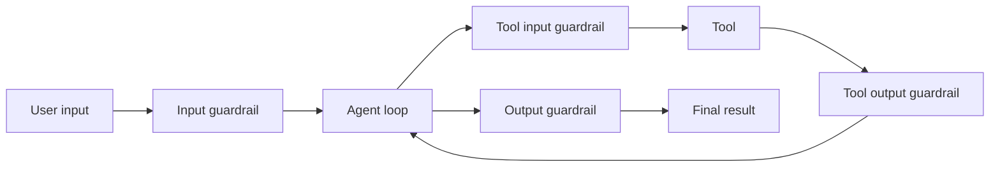

# Input, Output & Tool Guardrails

The Agents SDK distinguishes guardrail boundaries. Input guardrails inspect the initial user input, output guardrails inspect final agent output, and function-tool guardrails can run around each tool invocation.



```ts
type GuardrailDecision =
  | { behavior: 'allow' }
  | { behavior: 'rejectContent'; message: string }
  | { behavior: 'throwException'; reason: string };
```

## Boundary nuance

Agent-level input/output guardrails apply at workflow boundaries, not automatically to every internal specialist. Tool guardrails are the correct place for checks that must run on every custom function-tool execution.

Guardrails complement—not replace—authorization, sandboxing and policy enforcement.

## Practice

1. Which guardrail should validate every refund tool call?
2. Why is an output guardrail too late to prevent a destructive tool side effect?
3. What should be deterministic versus model-based in guardrails?
4. How would you trace guardrail trips for evals?
