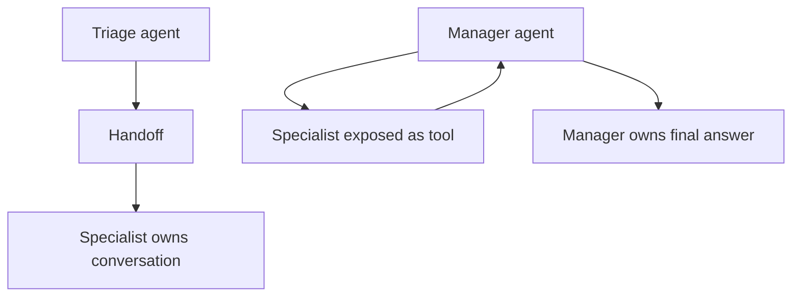

# Handoffs, Agents as Tools & Manager Patterns

There are two different multi-agent composition ideas.



A **handoff** transfers control to another agent. An **agent-as-tool** lets the current agent invoke a specialist and then continue owning the workflow.

```ts
import { Agent } from '@openai/agents';

const billing = new Agent({ name: 'Billing', instructions: 'Handle billing issues.' });
const triage = Agent.create({
  name: 'Triage',
  instructions: 'Route billing requests to the billing specialist.',
  handoffs: [billing],
});
```

## Choose deliberately

Use handoffs when the specialist should own the conversation. Use manager/agent-as-tool patterns when one orchestrator must synthesize multiple specialist results or retain final policy control.

## Practice

1. Who owns the conversation after a handoff?
2. When is a specialist better represented as a tool?
3. How can multi-agent systems increase latency/cost?
4. What state should be shared versus isolated between agents?
