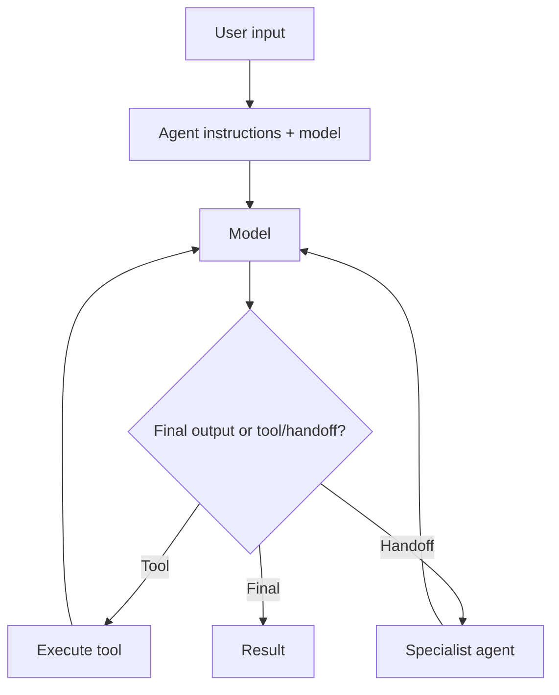

# OpenAI Agents SDK TypeScript Fundamentals

The OpenAI Agents SDK provides a TypeScript-first runtime for an agent loop, function tools, handoffs/agents-as-tools, guardrails, sessions, human-in-the-loop, tracing, realtime voice, MCP and sandboxed workspaces.



```ts
import { Agent, run } from '@openai/agents';

const agent = new Agent({
  name: 'Support Assistant',
  instructions: 'Answer support questions using approved tools and evidence.',
});

const result = await run(agent, 'Where is my order?');
console.log(result.finalOutput);
```

## Design rule

The SDK runs an agent loop, but application policy still owns authentication, authorization, tenancy, approvals and durable business state.

## Practice

1. What does the built-in agent loop automate?
2. What remains application responsibility?
3. When is a plain model call simpler than an Agent?
4. Why should agent runs have budgets/termination rules?
