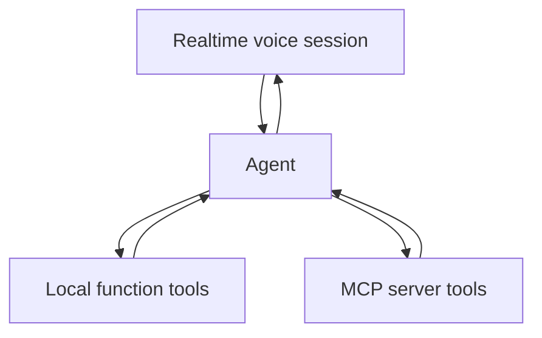

# Realtime Agents & MCP Integration

The Agents SDK can combine realtime voice interaction with tool orchestration, and can expose MCP server tools to agents alongside local function tools.



```ts
type ToolSource =
  | { kind: 'local'; name: string }
  | { kind: 'mcp'; server: string; name: string };
```

## Trust model

MCP tool descriptions and remote resources are external input. The agent runtime does not make them automatically trustworthy. Apply server allowlists, OAuth/scopes, user consent, tool policy and result sanitization.

Realtime adds interruption and latency constraints: long-running MCP work may need progress events, asynchronous tasks or a conversational acknowledgement instead of blocking speech.

## Practice

1. How do local tools and MCP tools differ operationally?
2. Why should an MCP server be allowlisted?
3. How would a long-running tool affect a voice conversation?
4. Which security checks stay outside the agent prompt?
