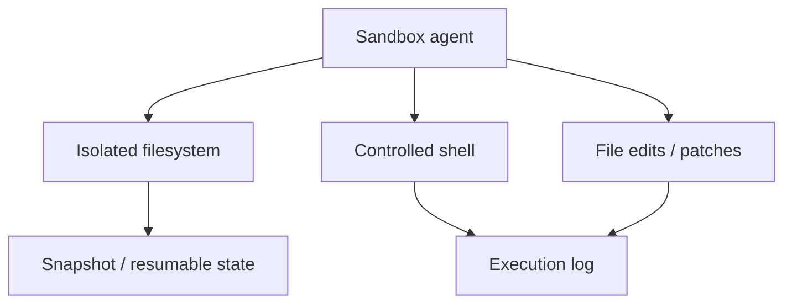

# Sandbox Agents

Sandbox agents operate inside an isolated workspace when tasks require files, shell commands, patches or repository inspection.



```ts
import { gitRepo, SandboxAgent } from '@openai/agents/sandbox';

const agent = new SandboxAgent({
  name: 'Repo Assistant',
  instructions: 'Inspect files before editing and run tests after changes.',
  defaultManifest: { entries: { repo: gitRepo({ repo: 'owner/repo' }) } },
});
```

## Security boundary

A sandbox reduces blast radius but must still define network egress, mounted secrets, filesystem scope, CPU/memory/time limits and approval for destructive/external actions.

## Practice

1. Why not run coding agents directly on the production host filesystem?
2. What network policy should a sandbox have by default?
3. Which artifacts should be captured after a run?
4. How would you prevent a repo agent from reading unrelated secrets?
