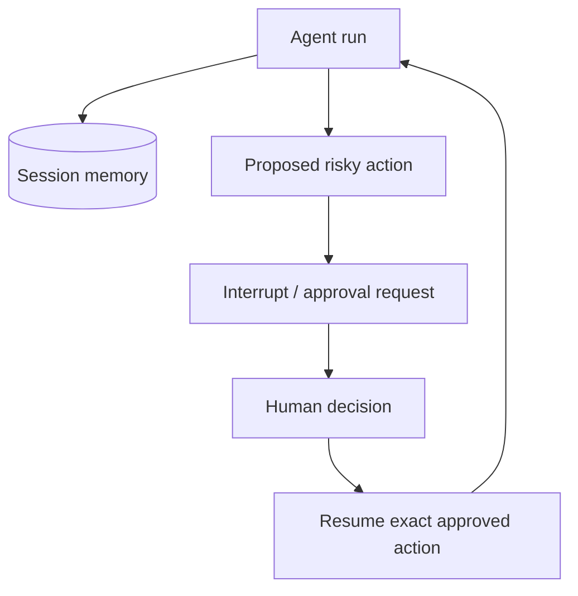

# Sessions, Memory & Human-in-the-Loop

Sessions persist working conversation context across agent runs. Human-in-the-loop pauses an action or workflow until a person approves, modifies or rejects it.



```ts
type ApprovalRecord = {
  runId: string;
  actionDigest: string;
  decision: 'approved' | 'modified' | 'rejected';
  actorId: string;
  decidedAt: string;
};
```

## Approval integrity

Bind approval to the exact normalized action payload/version. Never approve “refund something” and later let the model silently change amount/account before execution.

Session memory remains contextual data; authoritative product state should stay in your application/database.

## Practice

1. Why is a session not the same as a business database?
2. What does an approval digest protect against?
3. Which actions deserve HITL?
4. How should an expired approval be handled?
