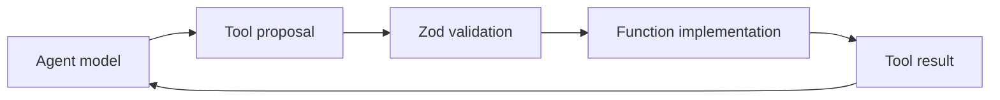

# Function Tools & Structured Output

Function tools expose typed TypeScript functions to an agent. The model proposes arguments; the runtime validates and invokes your code.



```ts
import { tool } from '@openai/agents';
import { z } from 'zod';

const lookupOrder = tool({
  name: 'lookup_order',
  description: 'Read an order that the authenticated user is allowed to view.',
  parameters: z.object({ orderId: z.string() }),
  execute: async ({ orderId }) => ({ orderId, status: 'processing' }),
});
```

Schema validation is not authorization. Bind user/tenant identity from trusted runtime context and enforce it inside the tool boundary.

Agents can also use structured output types for the final result so downstream application code receives a typed contract instead of prose parsing.

## Practice

1. Who actually executes a function tool?
2. Why is Zod validation insufficient for security?
3. Which tool outputs should be redacted before returning to the model?
4. When should final output be structured rather than text?
