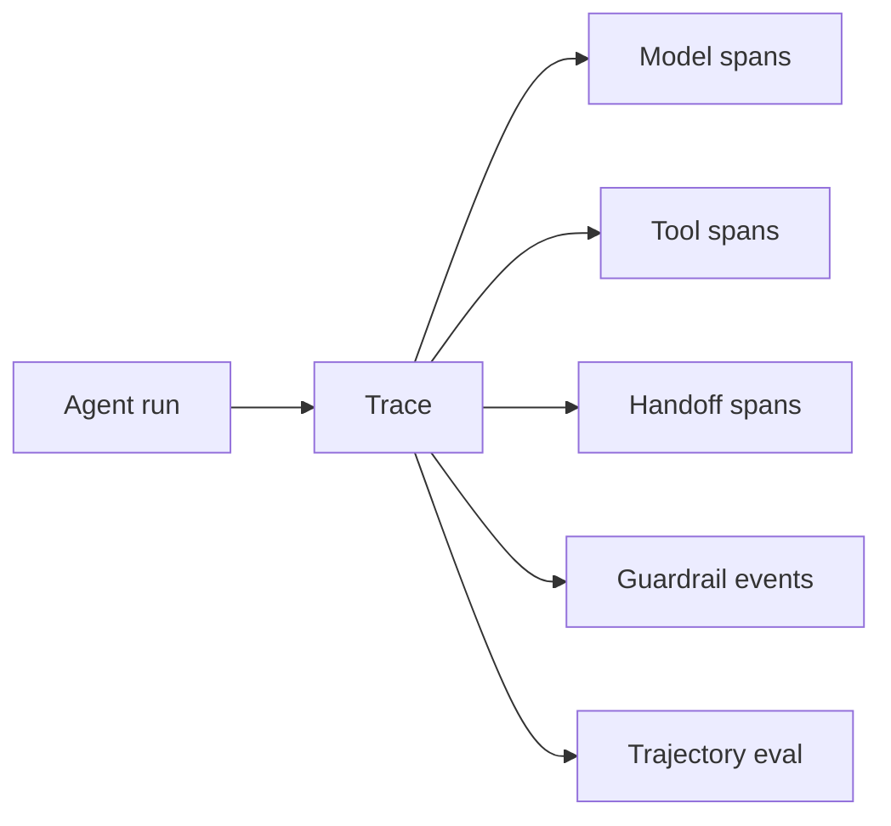

# Agent Tracing, Results & Evals

Agent correctness includes the path taken, not only final prose. Traces should capture model calls, tool calls, handoffs, guardrails, approvals, failures and token/cost metadata.



```ts
type TrajectoryEvent = {
  type: 'model' | 'tool' | 'handoff' | 'guardrail' | 'approval';
  name: string;
  status: 'ok' | 'error' | 'blocked';
  latencyMs: number;
};
```

Evaluate unnecessary tool calls, invalid arguments, duplicate side effects, permission violations, recovery quality and termination within budget.

## Practice

1. Why can a correct final answer still be a failed agent run?
2. What trajectory events should be normalized across framework upgrades?
3. How would you detect duplicate tool calls?
4. Which trace fields must be redacted?
