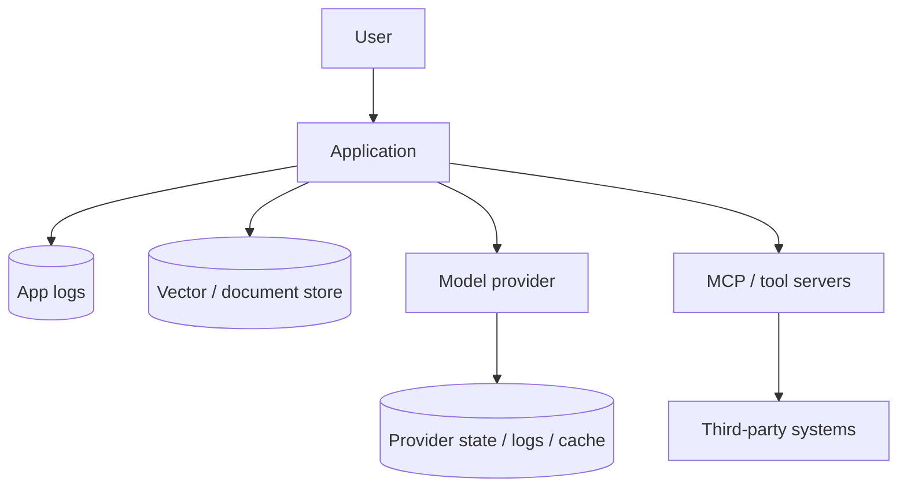

# AI Data-Flow Mapping & Trust Boundaries

Before choosing a provider or security control, map exactly where user data travels and where it is stored.



```ts
type DataFlow = {
  dataClass: 'public' | 'internal' | 'confidential' | 'regulated';
  destination: string;
  purpose: string;
  retentionDays?: number;
  encrypted: boolean;
};
```

## Questions every architecture should answer

What leaves your server? Which system stores it? For how long? In which region? Which subprocessors see it? Can users delete/export it? Does enabling background execution, files, conversation state or caching change retention?

## Practice

1. Draw the data flow for a RAG chatbot using a hosted LLM and remote MCP server.
2. Which boundaries require separate retention documentation?
3. Why are application logs part of the AI privacy model?
4. What changes when a user uploads a confidential PDF?
