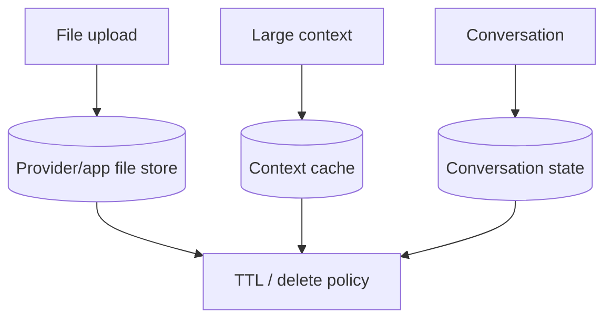

# Privacy of Files, Caches & Conversation State

Uploads, explicit context caches and server-side conversation state are persistent resources with their own lifecycle.



```ts
type StoredAiAsset = {
  externalId: string;
  kind: 'file' | 'cache' | 'conversation';
  tenantId: string;
  expiresAt?: string;
  deletionRequestedAt?: string;
};
```

Track external resource IDs so account deletion can delete provider-side assets as well as local database rows. Explicit caches save cost/latency but may create at-rest storage that has different privacy implications from ephemeral prompt processing.

## Practice

1. Why should provider file IDs be mapped to tenant IDs locally?
2. How is an explicit context cache different from in-memory prompt caching?
3. What should a deletion workflow do if provider deletion fails temporarily?
4. Which retention metadata belongs in an audit log?
