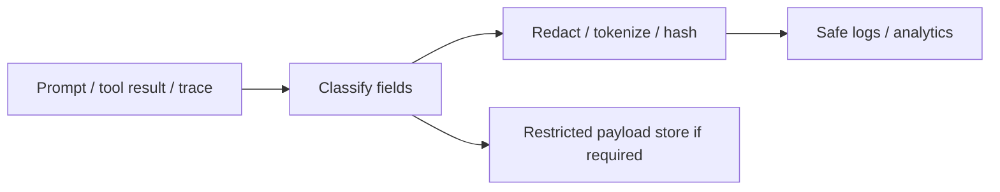

# PII, Secrets & Redaction

AI traces and prompts often contain more sensitive data than ordinary application logs because they include conversation text, retrieved documents and tool results.



```ts
const secretPatterns = [
  /sk-[A-Za-z0-9_-]+/g,
  /Bearer\s+[A-Za-z0-9._-]+/gi,
];

function redact(text: string) {
  return secretPatterns.reduce((s, re) => s.replace(re, '[REDACTED]'), text);
}
```

Regex is only one layer. Structured logging, DLP classifiers, allowlisted fields and separate restricted payload storage are safer than trying to clean arbitrary serialized objects afterward.

## Practice

1. Why are AI traces especially sensitive?
2. When is hashing preferable to dropping a value?
3. Why can tool outputs expose secrets indirectly?
4. What should be prohibited from ordinary telemetry by default?
