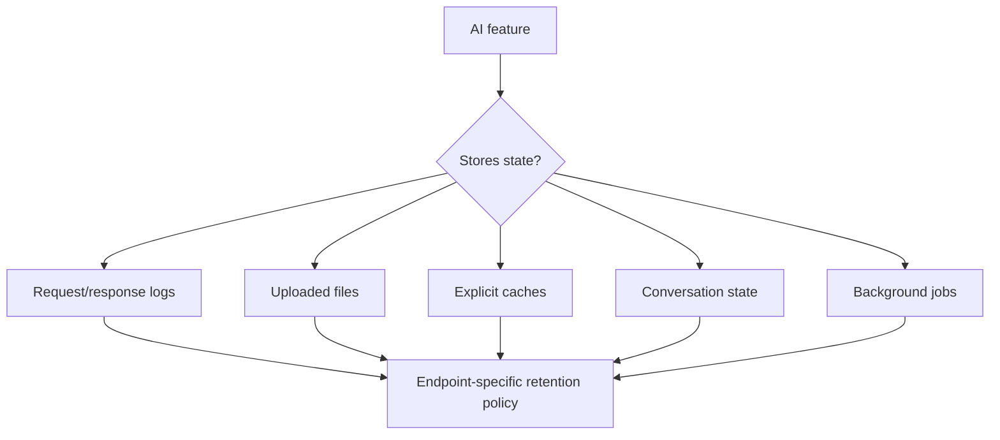

# Data Retention & Zero Data Retention (ZDR)

**Zero Data Retention** is not a universal magic switch. Provider policies can differ by endpoint, feature, plan and approval status. Stateful conversations, background jobs, uploaded files, explicit caches, web search/grounding and abuse monitoring can have distinct retention behavior.



```ts
type RetentionPolicy = {
  feature: string;
  storesAtRest: boolean;
  retentionDays?: number;
  deletionApi?: boolean;
  zdrCompatible: boolean;
};
```

## Engineering rule

Document retention at the **feature/endpoint** level and re-check provider docs during upgrades. Do not claim ZDR while your own database, trace platform or file store retains the same content indefinitely.

## Practice

1. Why can a provider support ZDR while one optional feature still stores data?
2. Which systems outside the model provider can violate a ZDR goal?
3. What should happen when a user requests deletion?
4. How would you test that `store=false`-style configuration is actually used on every route that requires it?
