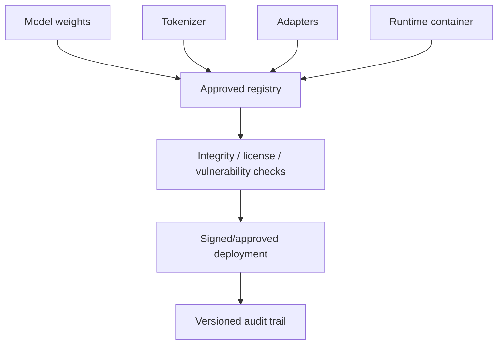

# Model Supply Chain, Governance & Auditability

AI systems depend on model weights, tokenizers, adapters, datasets, runtime containers, plugins/tools, MCP servers and evaluation artifacts. Treat them as a software/data supply chain.



```ts
type AiReleaseManifest = {
  modelDigest: string;
  tokenizerVersion: string;
  adapters: string[];
  runtimeImageDigest: string;
  evalRunId: string;
  approvedBy: string;
};
```

## Governance without bureaucracy theater

Define ownership, risk tiers, release gates, eval requirements, rollback, incident response, data lineage and approved provider/model catalogs. Every production answer does not need a human reviewer; every production capability needs clear accountability.

## Practice

1. Why pin model artifacts by digest?
2. What belongs in an AI release manifest?
3. How would you review a new external MCP server before production use?
4. What evidence should an auditor be able to reconstruct after a model incident?
