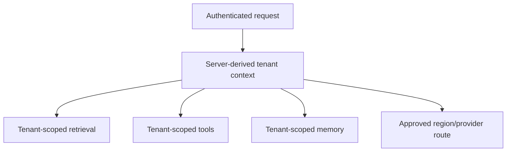

# Tenant Isolation, Residency & Regional Processing

Multi-tenant AI systems must enforce tenant boundaries across prompts, memories, RAG indexes, caches, files, traces, tools and provider resources.



```ts
type SecurityContext = {
  userId: string;
  tenantId: string;
  region: 'eu' | 'us' | 'apac';
  scopes: string[];
};
```

Never accept a model-generated `tenantId` as authorization. Derive tenant context from authenticated server state and inject it into every storage/query/tool boundary.

## Residency

Regional endpoint placement does not automatically prove all subprocessors, logs, backups and external tools remain in that region. Document the complete data path.

## Practice

1. Which AI subsystems can leak across tenants?
2. How would you test vector-store isolation?
3. Why is a model-produced tenant filter unsafe?
4. What evidence would you collect for a regional-processing requirement?
