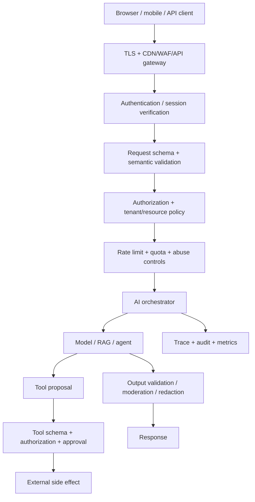

# Production Application Security, Validation & Reliability

A production AI application is still a production web/API application. LLM guardrails do **not** replace authentication, authorization, input validation, secure sessions, rate limits, encryption, backups, secure deployment, or incident response.

The safest mental model is a sequence of trust boundaries:



The model is inside the application security boundary. It does not define that boundary.

## Authentication vs authorization vs validation

These are different controls:

- **Authentication (AuthN):** who is making the request?
- **Authorization (AuthZ):** may that actor perform this action on this resource?
- **Validation:** is the input structurally and semantically acceptable?
- **Guardrail/policy:** is this AI behavior or action allowed under product/security rules?

A valid request can still be unauthorized. An authenticated user can still submit invalid data. A model can produce schema-valid arguments that violate permissions.

```text
authenticated != authorized
schema-valid != business-valid
authorized != safe without side-effect controls
model confidence != permission
```

## Validate every trust boundary

Use several layers rather than one giant validator.

```text
HTTP/body limits
   ↓
syntax / schema
   ↓
semantic invariants
   ↓
resource ownership / tenant policy
   ↓
business rules
   ↓
AI/tool policy
   ↓
side effect
```

TypeScript example:

```ts
import { z } from 'zod';

const RefundRequest = z.object({
  orderId: z.string().uuid(),
  amount: z.number().positive().max(10_000),
  reason: z.string().trim().min(3).max(500),
});

type Actor = {
  userId: string;
  tenantId: string;
  roles: string[];
  scopes: Set<string>;
};

async function requestRefund(raw: unknown, actor: Actor) {
  const input = RefundRequest.parse(raw); // structural validation

  const order = await orders.findById(input.orderId);
  if (!order || order.tenantId !== actor.tenantId) throw new Error('not_found');

  if (!actor.scopes.has('refunds:write')) throw new Error('forbidden');
  if (input.amount > order.remainingRefundableAmount) throw new Error('invalid_amount');

  return refunds.create({
    orderId: order.id,
    amount: input.amount,
    actorId: actor.userId,
  });
}
```

Do not use TypeScript types alone as validation. Runtime data from HTTP, models, tools, queues, webhooks, databases, MCP servers and external APIs is untrusted until checked.

## Authentication

Production authentication should define:

- identity provider and account lifecycle;
- password/passkey/MFA policy when applicable;
- email/phone verification where required;
- login throttling and credential-stuffing defenses;
- session/token issuance, expiry, revocation and rotation;
- account recovery;
- privileged/admin re-authentication;
- service-to-service identity.

For JWT/OIDC-style tokens, verify the cryptographic signature and expected issuer, audience, expiry and other required claims. Do not merely decode the token.

For browser sessions, use secure cookie properties where applicable:

```text
Secure
HttpOnly
SameSite appropriate to the flow
short bounded lifetime
server-side revocation / rotation strategy
```

Never let a model invent or override the authenticated actor identity.

## Authorization and permissions

Authorization should be deny-by-default and checked at the resource/action boundary.

Common models:

- RBAC: roles such as viewer/operator/admin;
- ABAC: attributes such as tenant, region, ownership, risk tier;
- ReBAC: relationships such as member-of/project-owner;
- OAuth scopes: delegated capabilities such as `documents:read` or `refunds:write`.

Object-level authorization is critical:

```ts
function authorizeDocumentRead(actor: Actor, document: DocumentRecord) {
  if (actor.tenantId !== document.tenantId) throw new Error('not_found');
  if (!actor.scopes.has('documents:read')) throw new Error('forbidden');
}
```

Do not trust model-produced `tenantId`, `userId`, resource ownership, role, scope, SQL filter, URL, filesystem path, or cloud-resource identifier as authorization evidence.

## AI tool permission boundary

The agent should receive only capabilities the authenticated actor can use.

```ts
type ToolDefinition = {
  name: string;
  requiredScopes: string[];
  risk: 'read' | 'write' | 'high';
};

function allowedTools(actor: Actor, tools: ToolDefinition[]) {
  return tools.filter(tool =>
    tool.requiredScopes.every(scope => actor.scopes.has(scope)),
  );
}
```

Then validate again at execution time. Tool discovery/filtering is not sufficient authorization because state and permissions can change between model proposal and execution.

High-risk writes should combine:

```text
schema validation
+ current authorization
+ business policy
+ exact-argument human approval when required
+ idempotency
+ audit record
```

## CORS, CSRF and browser-origin security

CORS is a browser access policy, not an authentication mechanism. Configure explicit trusted origins instead of reflecting arbitrary `Origin` values.

Cookie-authenticated state-changing endpoints need CSRF protection appropriate to the architecture, such as SameSite protections plus an anti-CSRF token/origin validation strategy.

Also define:

- CSP and safe HTML rendering where model output can reach a browser;
- output escaping to prevent XSS;
- clickjacking/frame policy when appropriate;
- WebSocket/SSE authentication and authorization;
- secure redirect allowlists.

Never render model-generated HTML as trusted markup without sanitization and product-specific justification.

## Rate limits, quotas and denial-of-wallet controls

AI endpoints can turn small requests into expensive model/tool workloads. Protect both availability and cost.

Rate-limit by the identities relevant to the threat model:

- IP/network source;
- anonymous/session/user identity;
- tenant/account;
- API key/client application;
- expensive feature/tool/model.

Also enforce budgets:

```ts
type RequestBudget = {
  maxInputTokens: number;
  maxOutputTokens: number;
  maxAgentSteps: number;
  maxToolCalls: number;
  maxWallClockMs: number;
  maxEstimatedCostUsd: number;
};
```

Use concurrency limits, bounded queues, request/body limits and load shedding. A rate limit measured only in requests/second can miss one extremely expensive request.

## File upload and document-ingestion security

RAG and multimodal systems commonly accept PDFs, images, audio, archives and office documents. Treat the entire ingestion pipeline as hostile input.

Controls include:

- allowlisted business-required formats/extensions;
- file-size and page/duration/dimension limits;
- do not trust the client `Content-Type` header alone;
- inspect signatures/magic bytes where useful;
- application-generated storage names;
- storage outside executable/web roots;
- malware/sandbox scanning where appropriate;
- decompression and archive-bomb limits;
- parser time/memory limits;
- path-traversal protection;
- tenant-aware object-store keys and access policy;
- prompt-injection treatment for extracted content;
- deletion/retention rules for originals and derived embeddings/chunks.

A document that passes malware scanning can still contain indirect prompt injection. Traditional file security and AI-content security are separate layers.

## External URLs, SSRF and egress

Any AI tool that can fetch a model-proposed URL can become an SSRF or data-exfiltration path.

Use:

- scheme allowlists (`https` when appropriate);
- destination/domain allowlists where practical;
- DNS/IP validation that accounts for redirects and rebinding;
- blocks for loopback, link-local, metadata and private/internal ranges unless explicitly required;
- redirect limits and destination re-validation;
- response-size/time limits;
- network egress policy outside the model.

Do not let the model decide which network destinations are trusted.

## Webhooks and replay protection

Inbound webhooks are untrusted external requests even when they come from a known provider.

Verify provider signatures using the **raw request body** when the provider requires it. Validate timestamp/freshness and defend against replay. Process repeated events idempotently.

```ts
async function handleWebhook(rawBody: Buffer, headers: Headers) {
  verifyProviderSignature(rawBody, headers);
  verifyFreshTimestamp(headers);

  const event = WebhookEvent.parse(JSON.parse(rawBody.toString('utf8')));

  if (await processedEvents.exists(event.id)) return { ok: true };

  await processEvent(event);
  await processedEvents.mark(event.id);
  return { ok: true };
}
```

Outbound webhooks/callbacks need destination validation, secret handling, retry limits and SSRF-safe configuration.

## Unsafe consumption of third-party APIs

Tool/API responses are external input. Do not assume another service already validated them.

Apply:

- TLS and endpoint verification;
- authentication/credential scope;
- response schema validation;
- timeouts and size limits;
- safe redirect behavior;
- escaping before rendering;
- sanitization/normalization only where semantically correct;
- rate-limit/circuit-breaker boundaries;
- least-privilege data returned to the model.

This applies to SaaS APIs, search results, MCP servers, plugins, web pages and internal microservices.

## Secrets and cryptography

Do not put long-lived secrets in prompts, source code, logs, client bundles, vector stores or model memory.

Use a secret manager/KMS where appropriate and define:

- least-privilege secret access;
- rotation and revocation;
- separate credentials per environment/service;
- TLS in transit;
- encryption at rest for sensitive stores/backups;
- envelope/field-level encryption when the threat model requires it;
- no secret values in traces or exception messages.

Hash passwords with an approved password-hashing algorithm; encryption is not a password-storage substitute.

## Tenant isolation and data lifecycle

Every persisted AI artifact can carry tenant-sensitive data:

```text
messages
files
chunks
embeddings
vector metadata
agent checkpoints
memory
cache entries
queued jobs
traces
feedback/eval samples
audit logs
```

Bind every artifact to authoritative tenant/user ownership and enforce isolation in application queries and infrastructure policy where possible.

Define collection purpose, retention, deletion, export, legal-hold exceptions, residency and backup behavior. Deleting the source document may also require deleting derived chunks, embeddings, cached answers and long-term memory.

## Logging, traces and audit records

Operational traces and security audit logs have different purposes.

**Traces/metrics** explain performance and failures. **Audit events** reconstruct security-sensitive actions.

A sensitive action audit record can include:

```ts
type SecurityAuditEvent = {
  requestId: string;
  actorId: string;
  tenantId: string;
  action: string;
  resourceId?: string;
  decision: 'allow' | 'deny' | 'approve' | 'reject';
  policyVersion: string;
  createdAt: string;
};
```

Prefer structured metadata over raw prompt/completion capture when full payloads are unnecessary. Redact secrets/PII before telemetry leaves the process.

Protect audit-log integrity and access. An audit log that an attacker or ordinary user can rewrite is weak evidence.

## Secure software supply chain and CI/CD

Production AI security includes normal software supply-chain controls plus AI artifacts.

Use risk-appropriate controls such as:

- dependency and vulnerability scanning;
- secret scanning;
- SAST and targeted DAST/security tests;
- container/base-image scanning;
- lockfiles and reproducible builds;
- SBOM/provenance where required;
- signed/verified release artifacts where supported;
- model/tokenizer/adapter/container digests;
- dataset and eval provenance;
- review of external plugins/MCP servers/tools;
- branch protection and least-privilege CI credentials.

Do not run untrusted model repositories, adapters, packages or tools with production secrets simply because they are popular.

## Timeouts, retries, circuit breakers and bulkheads

Every network/model/tool dependency needs a deadline.

Retry only failures likely to be transient. Use exponential backoff with jitter and a maximum attempt/deadline budget.

For write operations, combine retry logic with idempotency so uncertainty does not duplicate side effects.

Use circuit breakers and bulkheads so one failing provider/tool/tenant cannot consume the entire application's workers, connection pools or GPU capacity.

```text
request deadline
   ↓
per-dependency timeout
   ↓
classified failure
   ├─ transient -> bounded retry
   ├─ dependency unhealthy -> circuit breaker/fallback
   ├─ queue saturated -> shed/defer
   └─ invalid/forbidden -> no retry
```

## Queues, backpressure and idempotency

Long AI work should use durable jobs when appropriate. Define:

- unique logical job/action ID;
- idempotency key;
- lease/visibility timeout;
- retry count and schedule;
- dead-letter policy;
- cancellation;
- maximum queue age/deadline;
- concurrency policy;
- exactly what state is persisted before/after side effects.

Most distributed systems provide at-least-once behavior more easily than exactly-once behavior. Design writes so replay is safe.

## Backups, restore testing and disaster recovery

A backup strategy is incomplete until restore is tested.

Define:

- what is backed up: databases, object storage, vector-index source data, configuration and critical state;
- encryption and access controls for backups;
- retention and immutable/offline copies when justified;
- restore testing cadence;
- **RPO**: maximum acceptable data-loss window;
- **RTO**: maximum acceptable recovery time;
- rebuild strategy for derived indexes/embeddings;
- provider/region failure strategy;
- runbooks and ownership.

For derived vector indexes, preserving authoritative source documents plus deterministic/versioned ingestion may be more useful than relying only on a binary index backup.

## Deployment, migrations and rollback

Version together everything that can change behavior:

```text
application code
model/provider
system prompt
schema/tool definitions
retrieval/index version
policy/guardrails
eval suite
feature flags
```

Use database/schema migrations with backward/forward compatibility plans for rolling deploys.

Release patterns can include shadow traffic, canaries, feature flags and progressive rollout. Maintain a fast rollback path and separate **kill switches** for dangerous tools/features when rolling back the whole application is too slow.

Re-run authorization and safety checks after resume from long-lived checkpoints because permissions/policy may have changed while the run was paused.

## Health checks and graceful degradation

Separate process health from dependency readiness. Avoid health checks that overload an already failing dependency.

Define degraded behavior explicitly:

- model provider unavailable -> approved fallback or controlled error;
- vector search unavailable -> answer only if product policy permits non-RAG response;
- write tool unavailable -> do not pretend success;
- observability unavailable -> decide whether high-risk actions may continue;
- queue full -> reject/defer rather than growing unbounded memory.

## Security and reliability testing matrix

A production test strategy should include:

| Layer | Examples |
|---|---|
| Unit | validators, policy functions, tenant filters, idempotency |
| Integration | database/vector store, provider contracts, OAuth/token refresh |
| API/contract | schemas, authentication, error semantics, version compatibility |
| Authorization | object-level, property-level, cross-tenant negative tests |
| Web security | CSRF/CORS/session/XSS behavior relevant to the architecture |
| Tool/agent | allowed tools, denied writes, approval binding, replay |
| Evals | correctness, groundedness, relevance, trajectory and guardrail containment |
| Adversarial | prompt injection, jailbreaks, malicious documents, SSRF attempts |
| Load | realistic token/file/agent-step distributions, queue saturation |
| Failure/chaos | provider outage, timeout, duplicate delivery, worker restart |
| Recovery | database/object restore, index rebuild, failover/runbooks |
| Release | migration compatibility, canary thresholds, rollback |

Do not use an LLM judge for deterministic security properties that code can assert directly.

## Production request handler pattern

A simplified TypeScript boundary:

```ts
async function handleAiRequest(req: Request, deps: Deps) {
  const requestId = crypto.randomUUID();

  const actor = await deps.auth.authenticate(req);
  const input = AiRequestSchema.parse(await req.json());

  await deps.authz.assertAllowed(actor, 'assistant:use', input.workspaceId);
  await deps.quotas.consume(actor.tenantId, estimateRequestUnits(input));

  const policy = await deps.policy.forActor(actor);

  const result = await deps.agent.invoke(
    { messages: [{ role: 'user', content: input.message }] },
    {
      context: {
        actorId: actor.userId,
        tenantId: actor.tenantId,
        scopes: [...actor.scopes],
        policyVersion: policy.version,
      },
    },
  );

  const output = AiResponseSchema.parse(normalizeAgentResult(result));
  const safeOutput = await deps.outputPolicy.enforce(output, actor);

  deps.audit.record({
    requestId,
    actorId: actor.userId,
    tenantId: actor.tenantId,
    action: 'assistant:use',
    decision: 'allow',
    policyVersion: policy.version,
    createdAt: new Date().toISOString(),
  });

  return safeOutput;
}
```

This example is intentionally incomplete at the framework/network layer, but it demonstrates the key invariant: trusted identity and authorization context are derived by the application, then passed **into** the agent. They are never requested from the LLM.

## Production gate checklist

Before calling an AI application production-ready, answer these explicitly:

### Edge and API

- TLS everywhere sensitive data/authentication travels?
- request/body/header/file limits?
- authentication and session/token lifecycle?
- CORS/CSRF/browser-origin protections where applicable?
- rate limits, quotas, concurrency and denial-of-wallet controls?

### Authorization

- deny-by-default permissions?
- object/resource-level authorization?
- property/field-level restrictions when needed?
- tenant isolation?
- service-to-service identity/scopes?
- model unable to alter actor identity or privileges?

### Validation

- runtime schemas for requests, model outputs, tools, queues, webhooks and external APIs?
- semantic/business invariant checks?
- URLs/paths/IDs independently validated?
- secure file/document ingestion?

### Agent/tool safety

- least-privilege tool exposure?
- executor re-authorizes every sensitive action?
- high-risk human approval?
- idempotent writes?
- prompt-injection/jailbreak/red-team evals?
- sandbox/egress/SSRF protections?

### Data and privacy

- encryption in transit/at rest appropriate to risk?
- secrets manager/rotation?
- PII redaction/minimization?
- retention/deletion/export/residency?
- cache/vector/memory/checkpoint isolation?
- telemetry payload policy?

### Reliability

- deadlines/timeouts?
- bounded retry/backoff?
- circuit breakers/bulkheads?
- queues/backpressure/DLQ?
- graceful degradation?
- provider/model fallback evaluated?

### Operations

- traces/metrics/logs/audit events?
- SLOs/error budgets/alerts?
- cost budgets?
- backups plus proven restore?
- RPO/RTO/runbooks?
- incident kill switches?

### Delivery

- unit/integration/API/security/eval/load/recovery tests?
- dependency/secret/container scanning?
- versioned model/prompt/schema/policy/index artifacts?
- safe migrations?
- canary/progressive rollout?
- rollback tested?

If a high-risk production system cannot answer these questions, “the model passed evals” is not enough.

## Official references

- OWASP API Security Top 10 2023: https://owasp.org/API-Security/editions/2023/en/0x11-t10/
- OWASP Authentication Cheat Sheet: https://cheatsheetseries.owasp.org/cheatsheets/Authentication_Cheat_Sheet.html
- OWASP Session Management Cheat Sheet: https://cheatsheetseries.owasp.org/cheatsheets/Session_Management_Cheat_Sheet.html
- OWASP Input Validation Cheat Sheet: https://cheatsheetseries.owasp.org/cheatsheets/Input_Validation_Cheat_Sheet.html
- OWASP File Upload Cheat Sheet: https://cheatsheetseries.owasp.org/cheatsheets/File_Upload_Cheat_Sheet.html
- OWASP Web Service Security Cheat Sheet: https://cheatsheetseries.owasp.org/cheatsheets/Web_Service_Security_Cheat_Sheet.html
- NIST SP 800-218 Secure Software Development Framework: https://csrc.nist.gov/pubs/sp/800/218/final
- NIST SP 800-218A Generative AI SSDF Community Profile: https://csrc.nist.gov/pubs/sp/800/218/a/final

## Practice

1. Explain why authentication, authorization and validation must be separate checks.
2. Design a permission model for an agent that can read invoices but requires approval to issue refunds.
3. Show how a malicious PDF could pass normal file validation yet still attack an agent through indirect prompt injection.
4. Design idempotency and webhook replay protection for a payment-completion event.
5. Define RPO and RTO for an AI support platform that stores chat state, uploaded documents and a rebuildable vector index.
6. Write a production-release checklist for a new model/provider that includes deterministic tests, AI evals, security controls and rollback.