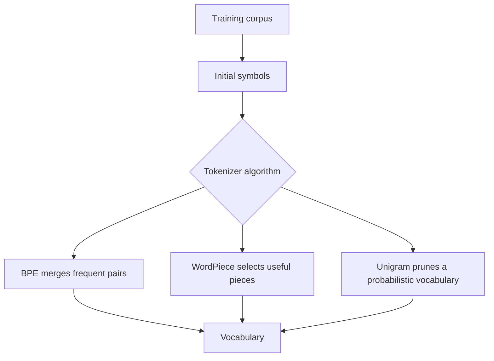

# BPE, WordPiece & Unigram Tokenization

Modern language models usually use **subword tokenization** so the vocabulary can represent common words efficiently while still composing rare words, names, code and multilingual text.



## BPE mental model

Byte Pair Encoding repeatedly merges frequent adjacent pieces. Byte-level variants begin from bytes, which guarantees every input can be represented without a traditional unknown token.

```ts
function pairCounts(tokens: string[][]) {
  const counts = new Map<string, number>();
  for (const word of tokens) {
    for (let i = 0; i < word.length - 1; i++) {
      const key = `${word[i]} ${word[i + 1]}`;
      counts.set(key, (counts.get(key) ?? 0) + 1);
    }
  }
  return counts;
}
```

WordPiece and Unigram use different vocabulary-selection objectives, so they should not be described as interchangeable implementations of BPE.

## Engineering consequences

Tokenizer choice changes token efficiency across languages and domains. Source code, JSON, IDs, whitespace and non-Latin scripts can tokenize very differently from ordinary English prose.

## Practice

1. Why are subwords a compromise between character and word tokenization?
2. What practical benefit does byte-level tokenization provide?
3. Why can tokenizer choice create fairness/cost differences between languages?
4. When would you retrain a tokenizer for a domain-specific model?
