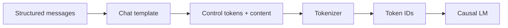

# Chat Templates & Control Tokens

A chat API exposes messages such as `system`, `developer`, `user`, `assistant` and tool events, but a causal language model still receives a **token sequence**. A **chat template** converts structured messages into the model-family-specific text/control-token format it was trained on.



Conceptual rendering:

```ts
type Message = { role: 'user' | 'assistant'; content: string };

function toyTemplate(messages: Message[]) {
  return messages.map(m => `<|${m.role}|>\n${m.content}<|end|>`).join('\n') + '\n<|assistant|>\n';
}
```

This is only a toy illustration. Real self-hosted models should use the tokenizer/model's supported template rather than manually guessing special tokens.

## Base vs chat model

A pretrained base model learns continuation. A chat/instruction model is post-trained on structured conversations and usually expects a particular formatting scheme. Using the wrong template can sharply reduce quality or tool-call reliability.

## Production rule

Hosted APIs should normally handle hidden/provider formatting. You need direct template control mainly when self-hosting open models or building custom training pipelines.

## Practice

1. Why is an array of chat messages not the literal input consumed by a causal LM?
2. What can go wrong when special tokens are duplicated?
3. Why can two instruct models require different chat templates?
4. When should application code avoid manually formatting chat tokens?
