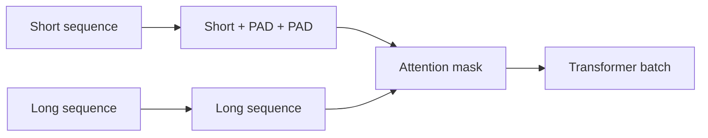

# Padding, Truncation & Attention Masks

Batched sequences often have different lengths. **Padding** aligns them to a common tensor shape. **Attention masks** identify which positions are real input versus padding. **Truncation** removes tokens when a sequence exceeds a configured limit.



```ts
function pad(ids: number[], length: number, padId = 0) {
  const clipped = ids.slice(0, length);
  return {
    inputIds: [...clipped, ...Array(Math.max(0, length - clipped.length)).fill(padId)],
    attentionMask: [...clipped.map(() => 1), ...Array(Math.max(0, length - clipped.length)).fill(0)],
  };
}
```

## Left vs right padding

Model families can have preferences depending on training and generation implementation. Do not change padding side without checking model/tokenizer guidance.

## Truncation is a correctness decision

Silent truncation can remove a system instruction, evidence, JSON suffix, tool result or user question. Production systems should budget and deliberately choose what may be dropped.

## Practice

1. What does an attention mask protect the model from attending to?
2. Why can silent truncation be a security problem?
3. Why might a batch need padding even though each request has a different length?
4. What metadata would you record when truncation occurs in production?
