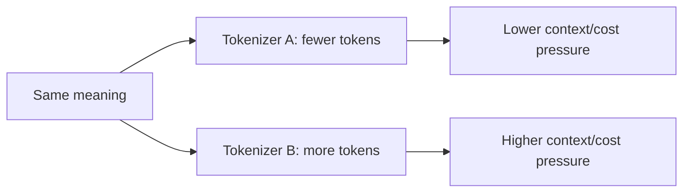

# Token Efficiency, Cost & Multilingual Effects

Applications pay, budget context and experience latency in tokens rather than words. Tokenization efficiency therefore affects product economics and sometimes user fairness.



```ts
function compareTokenizers(text: string, encoders: Record<string, (s: string) => number[]>) {
  return Object.fromEntries(
    Object.entries(encoders).map(([name, encode]) => [name, encode(text).length]),
  );
}
```

## Where inflation appears

- non-English languages;
- source code and indentation;
- long IDs and hashes;
- dense JSON/XML;
- unusual Unicode;
- repeated schemas/tool definitions.

Prompt caching can reduce repeated prefix compute/cost for supported providers, but it does not make excessive context free and does not change the model's context-window occupancy.

## Product implication

Benchmark token counts across real customer languages and payloads before choosing limits, pricing, truncation rules or model routes.

## Practice

1. Why can character count be a poor proxy for LLM cost?
2. How can tokenizer inefficiency affect multilingual users?
3. Does prompt caching reduce context-window usage?
4. What payload types in your product deserve token-count benchmarks?
