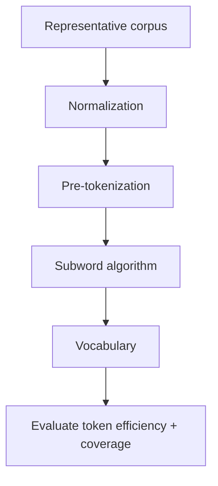

# Training & Evaluating a Tokenizer

Training a tokenizer means learning a vocabulary and tokenization model from representative text. It is distinct from training the neural network.



## Corpus design

A tokenizer trained mostly on English prose may be inefficient for source code, medical text, multilingual chat or structured data. Representative corpus composition matters before any transformer weight is trained.

```ts
function avgTokensPerCharacter(samples: string[], encode: (s: string) => number[]) {
  const chars = samples.reduce((n, s) => n + s.length, 0);
  const tokens = samples.reduce((n, s) => n + encode(s).length, 0);
  return tokens / Math.max(chars, 1);
}
```

Useful evaluation dimensions include compression/token efficiency, unknown handling, multilingual fairness, code/JSON behavior, stability around whitespace, and compatibility with downstream sequence limits.

## Migration cost

Changing tokenizer after pretraining is difficult because embedding/output matrices correspond to the old vocabulary. Some vocabulary expansion techniques exist, but they require deliberate model adaptation.

## Practice

1. What corpus would you use for a multilingual coding assistant tokenizer?
2. Why is token efficiency economically important?
3. Why is a tokenizer migration not equivalent to changing a text parser?
4. Design three tokenizer benchmarks for your product domain.
