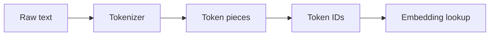

# Vocabulary, Token IDs & Special Tokens

A tokenizer maps text pieces to integer **token IDs** from a finite **vocabulary**. The model consumes IDs, not raw strings.



Special tokens represent protocol or sequence boundaries such as beginning/end of sequence, padding, unknown tokens, or chat-control markers. Their exact names and semantics are model-family specific.

```ts
type Vocabulary = Record<string, number>;
const vocab: Vocabulary = { '<bos>': 0, '<eos>': 1, hello: 2, world: 3 };
const ids = ['<bos>', 'hello', 'world', '<eos>'].map(t => vocab[t]);
console.log(ids);
```

## Why compatibility matters

Tokenizer vocabulary, special-token IDs and model weights are trained together. Swapping in an arbitrary tokenizer changes the IDs sent to embeddings and can destroy model behavior even when the visible text looks identical.

## Production implications

- pin tokenizer and model versions together;
- preserve exact templates for self-hosted chat models;
- do not assume every model uses BOS/EOS/PAD the same way;
- tokenizer changes can alter context length, cost and benchmark results.

## Practice

1. Why can two tokenizers produce different token counts for the same text?
2. Why is changing a tokenizer without retraining dangerous?
3. What roles can special tokens play?
4. Why should tokenizer version be part of model deployment metadata?
