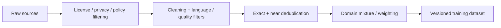

# Training Data Curation, Cleaning & Deduplication

Model quality begins with data design. A large noisy corpus is not automatically better than a smaller well-curated one.



```ts
function normalizeForExactDedup(text: string) {
  return text.toLowerCase().replace(/\s+/g, ' ').trim();
}
```

Exact hashing catches only identical content. Near-duplicate detection may use MinHash/LSH, embeddings or domain-specific fingerprints. Dataset curation must also track provenance, licensing, PII policy and removal requests.

## Mixtures

Pretraining corpora combine web, code, books, academic text, multilingual data and other sources with different weights. Changing mixture weights changes learned behavior.

## Practice

1. Why can duplicates distort training?
2. What information belongs in dataset lineage metadata?
3. How can evaluation contamination enter through training data?
4. Design a data-quality pipeline for a code-focused model.
