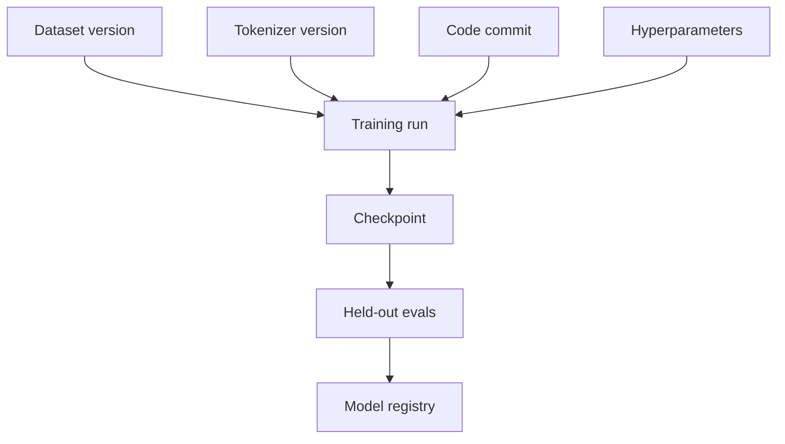

# Training Evaluation, Contamination & Lineage

A training run is trustworthy only when you can explain what data, tokenizer, code, configuration, checkpoint and eval set produced it.



```ts
type ModelLineage = {
  baseModel?: string;
  datasetVersion: string;
  tokenizerVersion: string;
  trainingCommit: string;
  evalSuiteVersion: string;
  artifactDigest: string;
};
```

## Contamination

If benchmark examples or close paraphrases enter training/prompt-development data, scores can overstate generalization. Contamination checks should include exact, fuzzy and semantic matching where practical.

## Release gate

Compare candidate vs baseline across target task quality, regressions, safety, latency/cost and subgroup/domain slices. Store eval evidence alongside the registered model version.

## Practice

1. What fields make model lineage reproducible?
2. Why is semantic contamination harder than exact duplication?
3. What evals would block a fine-tuned model release?
4. Why should artifacts be content-addressed or checksummed?
