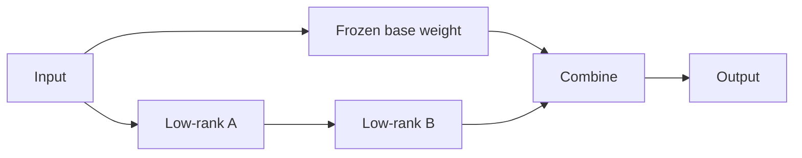

# LoRA & QLoRA Internals

**LoRA** freezes the original weight matrix and learns a low-rank update. Instead of updating a full `d × k` matrix, it learns two much smaller matrices whose product approximates the useful update.



A conceptual configuration:

```ts
type LoraConfig = {
  rank: number;
  alpha: number;
  targetModules: string[];
  dropout: number;
};
```

**QLoRA** combines a quantized base model with trainable LoRA adapters, greatly reducing memory requirements for fine-tuning.

## Rank and target modules

Higher rank increases adapter capacity and trainable parameters. Targeting attention projections only versus attention + MLP modules changes adaptation capacity and cost. Choose with evals, not folklore.

## Deployment

Adapters can be kept separate, merged into weights, switched per tenant or served dynamically depending on stack. Version adapter, base model and tokenizer together.

## Practice

1. Why does LoRA reduce trainable parameter count?
2. What does QLoRA quantize?
3. Why must an adapter declare its compatible base model?
4. What trade-off does LoRA rank control?
